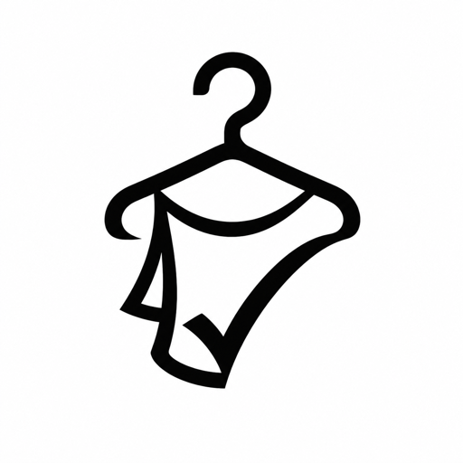
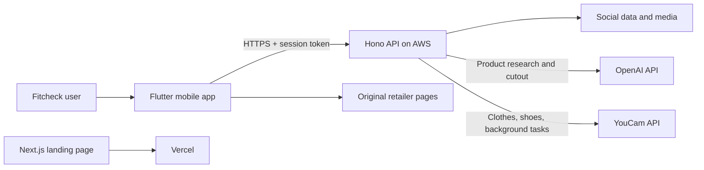

<p align="center">
  
</p>

<h1 align="center">Fitcheck</h1>

<p align="center">
  <strong>The social network for outfits.</strong><br />
  Discover what people are wearing, try their looks on yourself, save the fits
  you love, and shop the original pieces.
</p>

<p align="center">
  <a href="https://fitcheck-youcam.vercel.app">Live landing page</a>
  ·
  <a href="https://youcam2.15-206-240-61.sslip.io/health">API health</a>
  ·
  <a href="https://youcam-api.devpost.com/">YouCam API Hackathon</a>
</p>

## What is Fitcheck?

Fitcheck is a mobile-first social fashion app where outfits are the content.
People publish their own looks, browse outfits shared by the community, and
interact with complete fits instead of isolated product listings.

The key difference is that inspiration does not stop at a post. A viewer can
tap **Try**, choose a saved full-body photo, and use YouCam's virtual try-on to
see that outfit on themselves. Every tagged piece can retain its original
shopping link, and generated looks can be saved or published back to the feed.

The result is one continuous loop:

> **Discover → Try on → Save or shop → Post → Inspire someone else**

## Why it matters

Fashion discovery is social, but purchase decisions are personal. Traditional
social feeds show how an outfit looks on somebody else, while online stores show
products without the context of a complete look. Fitcheck connects both sides:

- **For shoppers:** more confidence before buying and fewer guesses about how a
  trend may look on them.
- **For creators:** outfit posts become interactive and shoppable rather than
  passive photos.
- **For retailers:** inspiration, virtual evaluation, and the original product
  page are connected in a single consumer journey.

## Core features

### Social outfit feed

- Browse a personalized, category-filtered masonry feed.
- Publish outfit photos with captions and tagged garments.
- Like and comment on community posts.
- Open creator profiles and browse their published looks.
- View the exact products attached to a post and follow their retailer links.

### Try another person's outfit

- Tap **Try** on a community post.
- Select one of your reusable full-body photos.
- Transfer the complete posted look through YouCam Apparel VTO.
- Save the generated result as a fit or use it as the start of a new post.

### Collections and shopping links

- Share a product directly from a shopping app into Fitcheck or paste its URL.
- Resolve retailer short links and preserve the canonical buying page.
- Extract the product title, brand, price, imagery, and category.
- Organize pieces into collections such as tops, bottoms, shoes, dresses, and
  accessories.
- Virtually try several compatible collection pieces as a composed outfit.

### Create and share

- Keep up to 12 reusable model photos.
- Build a look from saved products.
- Generate a YouCam preview and save it privately.
- Publish it with a consistent neutral editorial background.
- Let the next person try, save, and shop the look.

## YouCam API integration

Fitcheck was built for the **YouCam API Skin AI & Apparel VTO Hackathon** and
uses YouCam as the core visual engine of the product—not as a standalone demo
screen.

| YouCam capability | How Fitcheck uses it |
|---|---|
| **AI Clothes v3** | Applies upper-body, lower-body, full-body, and complete posted looks to a user's saved photo. |
| **AI Shoes** | Routes products classified as shoes through YouCam's dedicated shoes workflow. |
| **Background Replace** | Gives generated images a consistent neutral studio background before they enter the public feed. |

### Complete-look try-on

When someone taps **Try** on a post, Fitcheck sends their saved full-body photo
and the post's composed outfit image to AI Clothes v3 as a single full-body
transfer. Using one complete-look operation keeps the source composition more
stable than repeatedly editing the output once for every tagged hotspot.

### Collection try-on

For an outfit assembled from saved products, the backend applies up to six
supported pieces in a deliberate order: full-body garments, tops, bottoms, and
then shoes. If a full-body garment is selected, conflicting top and bottom
pieces are skipped. Accessories remain taggable and shoppable but are not sent
to an incompatible virtual try-on engine.

### Provider workflow

All YouCam work happens on the server:

1. Validate the source and reference images.
2. Request signed upload destinations from YouCam.
3. Upload the image bytes directly to those destinations.
4. Create the appropriate Clothes, Shoes, or Background task.
5. Poll the asynchronous task with bounded retries and friendly error mapping.
6. Download the completed image before its temporary provider URL expires.
7. Store it behind a stable Fitcheck media URL.

The `YOUCAM_API_KEY` and account secret never ship in the Flutter application.
Source photos must be clear JPG or PNG images under 10 MB; a front-facing,
single-person, head-to-feet photo gives the best virtual try-on result.

## Product-link intelligence

YouCam powers the visual try-on. A complementary OpenAI pipeline turns a raw
shopping link into a usable Fitcheck garment:

1. The app expands common retailer short links on the user's connection.
2. The backend normalizes the destination and removes tracking parameters.
3. Deterministic parsers inspect JSON-LD, microdata, embedded application state,
   OpenGraph metadata, and declared product images.
4. If a retailer blocks server requests or serves an empty app shell, OpenAI
   web search identifies the exact product and its direct product imagery.
5. OpenAI produces the transparent garment asset used by Fitcheck's product
   cards and hotspots.
6. The clean product image—not the retailer webpage—is passed to YouCam as the
   garment reference.

OpenAI research fails explicitly when it cannot confirm the exact linked item;
it does not silently substitute a similar product.

## Architecture



The server owns authentication, posts, collections, model photos, saved fits,
media, product extraction, and every provider request. The client contains no
OpenAI or YouCam credentials.

## Technology

| Layer | Stack |
|---|---|
| Mobile application | Flutter, Dart |
| API | Node.js, Hono |
| Virtual try-on | Perfect Corp YouCam AI Clothes v3 and AI Shoes |
| Published-post presentation | YouCam Background Replace |
| Product research and cutouts | OpenAI Responses API, web search, image generation |
| Authentication | Google ID tokens with server-issued sessions |
| Demo persistence | JSON store and local media directory on persistent EBS |
| Backend hosting | AWS EC2, Caddy, systemd |
| Landing page | Next.js App Router, React, Vercel |

## Repository structure

```text
.
├── lib/                 Flutter application, screens, models, and services
├── assets/              Mobile fonts and visual assets
├── android/             Android host and native share-target integration
├── ios/                 iOS host and Share Extension
├── test/                Flutter unit and widget tests
├── server/              Hono API, provider integrations, data, and tests
├── landing/             Standalone Next.js marketing site
└── deploy/              AWS EC2, Caddy, and systemd deployment files
```

## Run locally

### Prerequisites

- Flutter SDK compatible with Dart `^3.12.0`
- Node.js 20 or newer
- An Android/iOS device or emulator
- A YouCam API key
- An OpenAI API key

### 1. Start the backend

```bash
cd server
npm install
cp .env.example .env
```

Add at least these values to `server/.env`:

```dotenv
OPENAI_API_KEY=your_openai_key
YOUCAM_API_KEY=your_youcam_key
YOUCAM_SECRET_KEY=your_youcam_secret
```

Then start the API:

```bash
npm run dev
```

The server listens on `http://0.0.0.0:8787`. Confirm its configuration at
`http://127.0.0.1:8787/health`.

### 2. Run the Flutter app

From the repository root:

```bash
flutter pub get
flutter run --dart-define=API_URL=http://127.0.0.1:8787
```

For a physical Android device, map the backend port before launching:

```bash
adb reverse tcp:8787 tcp:8787
flutter run --dart-define=API_URL=http://127.0.0.1:8787
```

Without an explicit `API_URL`, release builds use the deployed AWS API. Debug
builds use the ADB-reversed local API by default.

### 3. Run the landing page

```bash
cd landing
npm install
npm run dev
```

Open `http://localhost:3000`. A production build can be verified with:

```bash
npm run build
npm start
```

## Environment variables

Copy `server/.env.example` to `server/.env`. Never expose or commit the real
file.

| Variable | Required | Purpose |
|---|---:|---|
| `OPENAI_API_KEY` | Yes | Exact-product research, missing metadata, and transparent cutouts. |
| `YOUCAM_API_KEY` | Yes | Bearer credential for YouCam server-to-server APIs. |
| `YOUCAM_SECRET_KEY` | Account-dependent | Retained server-side for account/webhook integrations. |
| `OPENAI_RESEARCH_MODEL` | No | Model used when deterministic product extraction fails. |
| `YOUCAM_TIMEOUT_MS` | No | Maximum time allowed for an asynchronous YouCam task. |
| `YOUCAM_POLL_MS` | No | Initial polling interval for YouCam tasks. |
| `GOOGLE_CLIENT_ID` | Production | Allowed Google OAuth audience(s), comma-separated. |
| `SEED_DEMO_DATA` | No | Seeds the versioned social feed on first startup; defaults to `true`. |
| `DATA_FILE` | No | Persistent account, session, collection, post, and fit store. |
| `MEDIA_DIR` | No | Persistent uploads and generated media directory. |
| `PORT` | No | API port; defaults to `8787`. |

When `GOOGLE_CLIENT_ID` is unset, the backend accepts development stand-in
sessions. Configuring it automatically disables that development path.

## Main API routes

| Route | Purpose |
|---|---|
| `GET /health` | Provider and server readiness. |
| `POST /api/ingest` | Turn a shopping link or shared text into a categorized garment. |
| `GET/POST /api/posts` | Read the social feed or publish an outfit. |
| `POST /api/posts/:id/like` | Toggle a like. |
| `POST /api/posts/:id/comments` | Add a comment. |
| `GET/POST /api/collections` | Manage personal product collections. |
| `GET/POST /api/model-photos` | Manage reusable full-body photos. |
| `POST /api/try-on/post` | Transfer a complete community outfit with YouCam. |
| `POST /api/try-on/model` | Apply one saved garment to a stored photo. |
| `POST /api/try-on/outfit` | Generate a multi-piece collection outfit. |
| `GET/POST /api/saved-fits` | Store generated looks and publish them later. |

See [`server/README.md`](server/README.md) for request formats, authentication,
provider behavior, and the complete endpoint reference.

## Tests

### Flutter

```bash
flutter analyze
flutter test
```

### Backend

```bash
cd server
npm run test:feed
npm run test:social
npm run test:model-photos
npm run test:http-model-photos
npm run coverage
```

`npm run coverage` tests deterministic retailer extraction. Use
`npm run coverage -- --research zara` or `npm run test:research` only when you
intend to exercise the paid OpenAI web-search fallback.

## Deployment

- **Landing page:** deployed as a static Next.js production site on Vercel at
  [fitcheck-youcam.vercel.app](https://fitcheck-youcam.vercel.app).
- **Backend:** deployed on AWS EC2 behind Caddy HTTPS at
  [youcam2.15-206-240-61.sslip.io](https://youcam2.15-206-240-61.sslip.io/health).
- **Mobile:** release builds point to the hosted API with
  `--dart-define=API_URL=https://youcam2.15-206-240-61.sslip.io`.

AWS runtime details and release layout are documented in
[`deploy/README.md`](deploy/README.md).

## Security and privacy notes

- Provider credentials live only in the backend environment.
- Model-photo and mutation routes require an authenticated session.
- Public profiles do not expose email addresses or private model photos.
- Retailer URLs are normalized and validated before server-side fetching.
- Generated provider URLs are downloaded and re-hosted so expired signed URLs
  do not break saved fits or posts.
- The bundled JSON store and local media layout are appropriate for the
  hackathon demo; a larger production rollout should move private media to
  signed object storage and records to a managed database.

## Hackathon alignment

Fitcheck addresses the hackathon's **Apparel Virtual Try-On** track by replacing
the uncertainty between seeing an outfit and deciding whether it works for you.
Its consumer value comes from integrating VTO into a complete social product:
discovery, personalization, saving, publishing, and shopping—not from wrapping
a single API call.

Built with the [Perfect Corp YouCam API](https://yce.perfectcorp.com/) for the
[YouCam API Skin AI & Apparel VTO Hackathon](https://youcam-api.devpost.com/).
